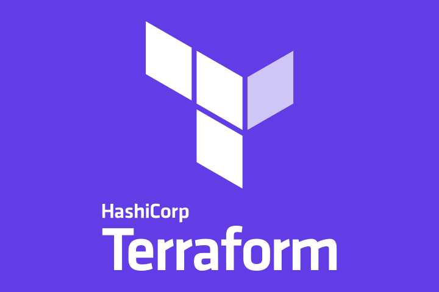

# Terraform in most simplest way 

## Here you can learn from ABC to XYZ of terraform 

## Important information 

<ul> 
   <li> Open Source IAC TooL </li>
   <li> Created by HashiCorp </li>
   <li> It has Declarative COnfiguration language called [HCL] --> HashiCorp Configuration Language </li>
   <li> Written in Go lang </li> 
   <li> Terraform Github link [Github](https://github.com/hashicorp/terraform) </li>   
   <li>  Official Docs [terraformDocs](https://www.terraform.io/docs/index.html) </li>
   <li> First release : July 28 2014 </li>
  
</ul>

### LogO 

