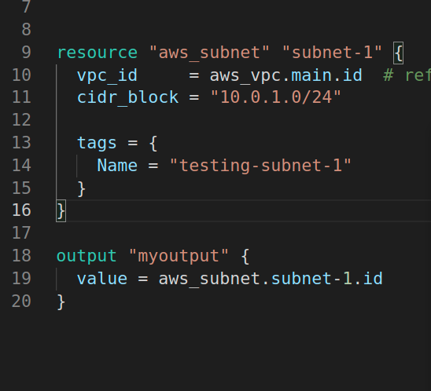

# Terraform in most simplest way 

## Here you can learn from ABC to XYZ of terraform 

## Important information 

<ul> 
   <li> Open Source IAC TooL </li>
   <li> Created by HashiCorp </li>
   <li> It has Declarative COnfiguration language called [HCL] --> HashiCorp Configuration Language </li>
   <li> Written in Go lang </li> 
   <li> Terraform Github link [Github](https://github.com/hashicorp/terraform) </li>   
   <li>  Official Docs [terraformDocs](https://www.terraform.io/docs/index.html) </li>
   <li> First release : July 28 2014 </li>
  
</ul>

# Terraform important commands

##  plan commands

###  check (dry-run) all tf files

```
fire@XIA:~/Desktop/tech/terraform/project2$ ls
ec2_create.tf  maint.tf  terraform.tfstate  terraform.tfstate.backup  vpc_create.tf
fire@XIA:~/Desktop/tech/terraform/project2$ 
fire@XIA:~/Desktop/tech/terraform/project2$ terraform  plan 

Terraform used the selected providers to generate the following execution plan. Resource actions are indicated with the following symbols:
  + create

Terraform will perform the following actions:

  # aws_eip.webEIP will be created
  + resource "aws_eip" "webEIP" {
      + allocatio


=== In the last of output 

Plan: 9 to add, 0 to change, 0 to destroy.


```

### Plan againts a single resource

```
fire@XIA:~/Desktop/tech/terraform/project2$ terraform  plan  -target=aws_vpc.ashuvpc 

Terraform used the selected providers to generate the following execution plan. Resource actions are indicated with the following symbols:
  + create

Terraform will perform the following actions:

  # aws_vpc.ashuvpc will be created
  + resource "aws_vpc" "ashuvpc" {
      + arn                

```


###  deploy all tf file 

```
ire@XIA:~/Desktop/tech/terraform/project2$ ls
ec2_create.tf  maint.tf  terraform.tfstate  terraform.tfstate.backup  vpc_create.tf
fire@XIA:~/Desktop/tech/terraform/project2$ 
fire@XIA:~/Desktop/tech/terraform/project2$ 
fire@XIA:~/Desktop/tech/terraform/project2$ **terraform  apply **

Terraform used the selected providers to generate the following execution plan. Resource actions are indicated with the following symbols:
  + create

Terraform will perform the following actions:

  # aws_eip.webEIP will be created
  + resource "aws_eip" "webEIP" {
      + allocation_id             = (known after apply)
      + associate_with_private_ip = "10.0.1.50"
      + association_id            = (known after apply)
      + carrier_ip    


===  IN THE LAST 

Plan: 9 to add, 0 to change, 0 to destroy.

Do you want to perform these actions?
  Terraform will perform the actions described above.
  Only 'yes' will be accepted to approve.

  Enter a value
  
```

### Deploy with auto approve

```
fire@XIA:~/Desktop/tech/terraform/project2$ terraform  apply   --auto-approve

```

### Deploy  a particular resource rather entire tf file 

```
terraform  destroy  -target=aws_vpc.ashuvpc --auto-approve

```


###  state commands 

```
ire@XIA:~/Desktop/tech/terraform/project1$ terraform  state list
aws_subnet.subnet-1
aws_vpc.main

```

### details of resources 

```
ire@XIA:~/Desktop/tech/terraform/project1$ terraform  state  show aws_vpc.main
# aws_vpc.main:
resource "aws_vpc" "main" {
    arn                              = "arn:aws:ec2:us-east-2:061112302981:vpc/vpc-03066cc81461d60bd"
    assign_generated_ipv6_cidr_block = false
    cidr_block                       = "10.0.0.0/16"
    default_network_acl_id           = "acl-08ac51b13ef4ded8b"
    default_route_table_id           = "rtb-0fae584606c06ed5f"
    default_security_group_id        = "sg-0b79081a5cb80dc4d"
    dhcp_options_id                  = "dopt-d1c23eba"
    enable_dns_hostnames             = false
    enable_dns_support               = true
    id                               = "vpc-03066cc81461d60bd"
    instance_tenancy                 = "default"
    main_route_table_id              = "rtb-0fae584606c06ed5f"
    owner_id                         = "061112302981"
    tags                             = {
        "Name" = "testing-vpc"
    }
    tags_all                         = {
        "Name" = "testing-vpc"
    }

```

### terraform output section 

### if we add output section in tf file



### Now we can use refresh command to update this without any deployment 

```
fire@XIA:~/Desktop/tech/terraform/project1$ terraform  refresh 
aws_vpc.main: Refreshing state... [id=vpc-03066cc81461d60bd]
aws_subnet.subnet-1: Refreshing state... [id=subnet-04bc8c5e2bc29ee8d]

Outputs:

myoutput = "subnet-04bc8c5e2bc29ee8d"

```

### now we can check output only if we want 

```
fire@XIA:~/Desktop/tech/terraform/project1$ terraform  output 
myoutput = "subnet-04bc8c5e2bc29ee8d"

```

### Terraform destroy 

```
terraform  destroy # to delete every thing

----

terraform  destroy --auto-approve

----

terraform  destroy  -target=aws_vpc.ashuvpc --auto-approve

```


  
