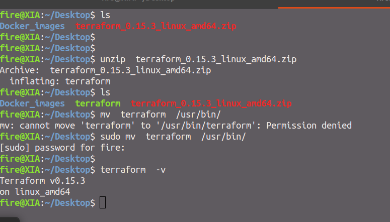

# Terraform in most simplest way 

## Here you can learn from ABC to XYZ of terraform 

## Important information 

<ul> 
   <li> Open Source IAC TooL </li>
   <li> Created by HashiCorp </li>
   <li> It has Declarative COnfiguration language called [HCL] --> HashiCorp Configuration Language </li>
   <li> Written in Go lang </li> 
   <li> Terraform Github link [Github](https://github.com/hashicorp/terraform) </li>   
   <li>  Official Docs [terraformDocs](https://www.terraform.io/docs/index.html) </li>
   <li> First release : July 28 2014 </li>
  
</ul>


# Installation 

### Terraform can be installed in ALL OS platform including  Windows / Mac / Linux 

## TO download terraform for your selected OS you can choose link from below given URL 

[Terraform_Download](https://www.terraform.io/downloads.html)

## Installing in any Linux Platform 



## checking installation 

```
fire@XIA:~/Desktop$ terraform  -v
Terraform v0.15.3
on linux_amd64

```


