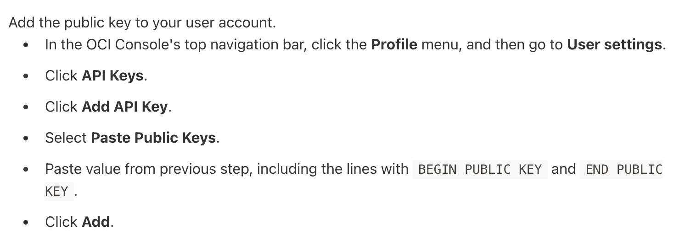

# Setup OCI -- connection with terraform 

## After installing terraform in your machine follow given steps 

### Step 1  :- Checking terraform version 

```
 oci_terraform terraform -v
Terraform v1.6.2
on darwin_arm64
+ provider registry.terraform.io/oracle/oci v5.19.0

Your version of Terraform is out of date! The latest version
is 1.6.3. You can update by downloading from https://www.terraform.io/downloads.html
```

### Creating RSA key pair to add in OCI account 

```
mkdir  ~/.oci
openssl genrsa  -out ~/.oci/private.pem 2048
chmod 600 ~/.oci/private.pem
openssl rsa -pubout -in ~/.oci/private.pem  -out  ~/.oci/public.pem


```

### Copy the public key  and paste in given location 

```
cat  ~/.oci/public.pem

===========>>

```

### login to OCI account and follow 




