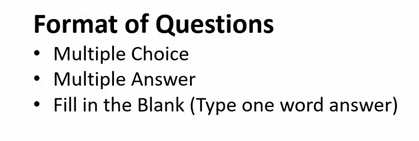

## Certification --

### Passing Crition - 70%  

 Like Other MCQ exams Terraform uses scaled scoring so you have to target atleast 75%  

### Some more Info about exam 

<ol>
  <li> Duration is 60 Minutes  </li>
  <li> Seat time is 90 Minutes -- which means you have to sit 30 minute early before exam start  </li>
  <li> Validity of exam is 24 Months  </li>
  <li> There are 57 Questions </li>
  <li> You can affort 17 wrong Question near about </li>
  <li> There is no Negative Marking  </li>
  <li> Question types  </li>
  
  
</ol>

### HashiCorp exam URL 
[Click_here](https://www.hashicorp.com/certification/terraform-associate)

### HCL --- HashiCorp Configuration Language 

 A declarative language that support programming language like features like variables ,loops Dynamicblocks , maps etc 

### Idempotent vs non-idempotent 

