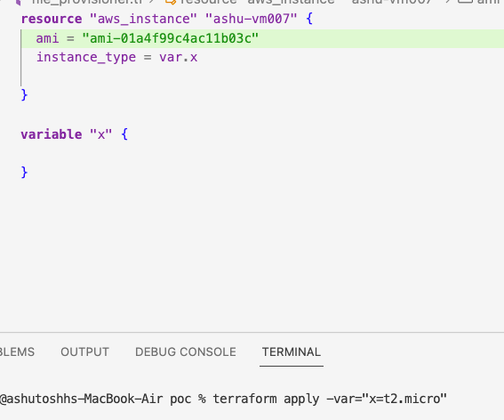

## Terraform variables 

### apart from basic we can also pass variables values from command line 




## Using tfvars --

### poc.tf

```
resource "aws_instance" "ashu-vm007" {
  ami = var.y
  instance_type = var.x
  
}

variable "x" {
  
}

variable "y" {
  
}

```

### stage.tfvars

```
x="t2.micro"
y="ami-01a4f99c4ac11b03c"
```

### using this file to update it 

```
fire@ashutoshhs-MacBook-Air poc % terraform apply -var-file="stage.tfvars"

Terraform used the selected providers to generate the following execution plan. Resource actions are indicated with
the following symbols:
  + create

Terraform will perform the following actions:

  # aws_instance.ashu-vm007 will be created
  + resource "aws_instance" "ashu-vm007" {
```

### Some more tips to pass ENV variables 

```
terraform apply -var="image_id=ami-abc123"
terraform apply -var='image_id_list=["ami-abc123","ami-def456"]' -var="instance_type=t2.micro"
terraform apply -var='image_id_map={"us-east-1":"ami-abc123","us-east-2":"ami-def456"}'

```

### Using tfvars in terraform apply 

```
terraform apply -var-file="stages.tfvars"

```


